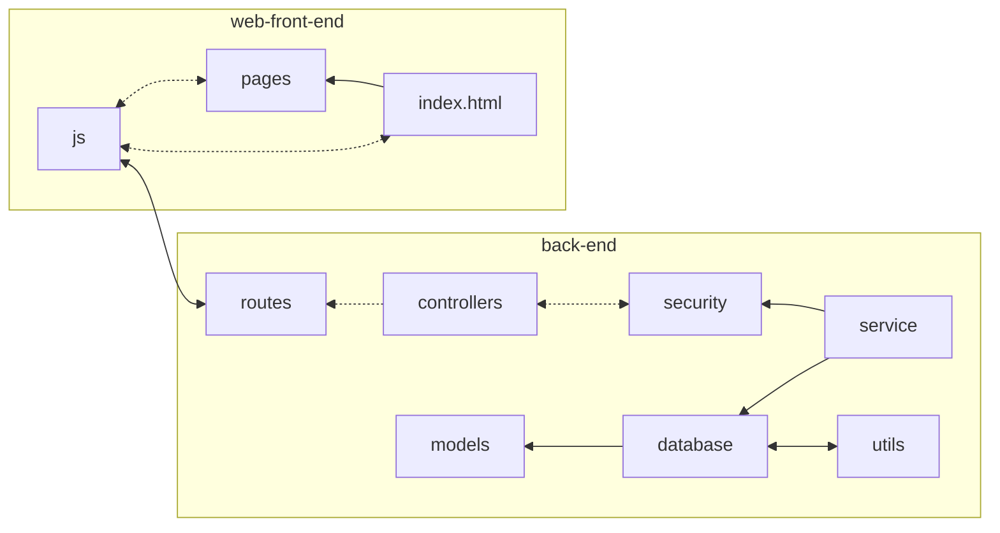

# Authentication and Authorisation with ExpressJS
# README
> [!IMPORTANT]
> It is recommended to read through each `README.md` file in the `back-end` and `web-front-end` folders as they contain information that you might need for installation and further understanding of the project.
## File Structure

```
.
├── back-end
│   ├── app.js
│   ├── controllers
│   │   ├── adminController.js
│   │   └── authController.js
│   ├── models
│   │   └── UserModel.js
│   ├── package.json
│   ├── package-lock.json
│   ├── README.md
│   ├── routes
│   │   ├── adminHandling.js
│   │   └── authHandling.js
│   ├── service
│   │   ├── database
│   │   │   ├── db.js
|   |   |   └── db.sqlite
│   │   └── security
│   │       └── authentication.js
│   └── utils
│       └── helper.js
└── web-front-end
    ├── index.html
    ├── js
    │   └── scripts.js
    ├── pages
    │   ├── profile.html
    │   └── register.html
    ├── README.md
    └── styles
        └── styles.css
```
Note: Not all files are indicated.
### We do recommend this flowchart to know how the files and folders are interconnected they are.


